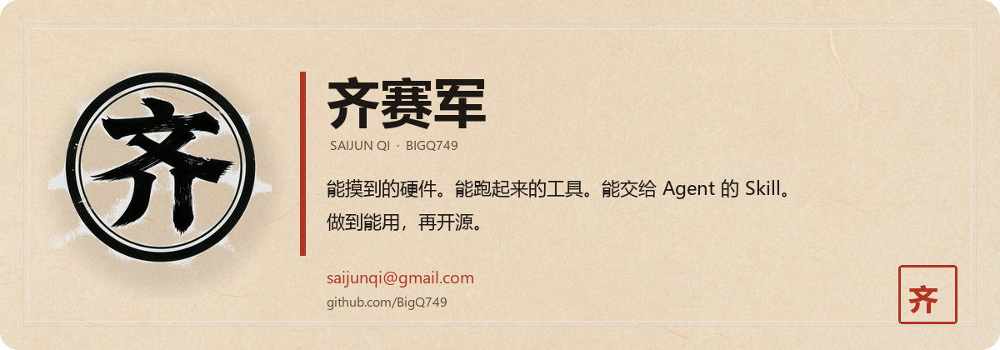
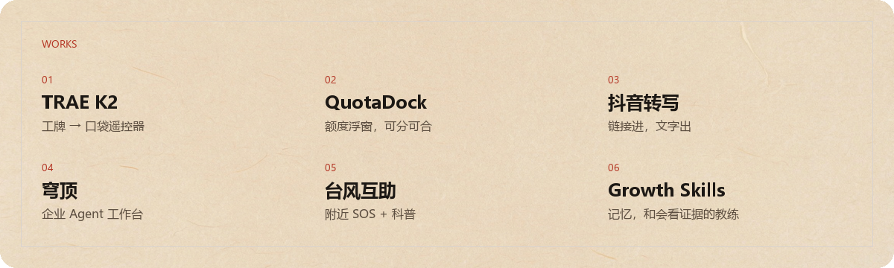

  <strong>简体中文</strong> · <a href="./README.en.md">English</a>

  

  

  

- [TRAE K2](https://github.com/BigQ749/trae-k2-remote) — 大赛工牌烧成闪电说 / PPT 遥控器，不用伴侣脚本。
- [QuotaDock](https://github.com/BigQ749/quotadock) — 桌面额度浮窗。Codex、Grok、OpenCode 可分可合。
- [Douyin Video Analyzer](https://github.com/BigQ749/douyin-video-analyzer-skill) — 抖音链接进，文字稿和摘要出。
- [穹顶](https://github.com/BigQ749/dome-enterprise-ai-workbench) — 本地优先的企业 Agent 工作台。
- [Typhoon Relief](https://github.com/BigQ749/typhoon-relief) — 微信小程序：附近 SOS + 防灾科普。
- [Codex Growth Skills](https://github.com/BigQ749/codex-growth-skills) — 给 Codex 用的学习记忆和成长教练。

📫 [saijunqi@gmail.com](mailto:saijunqi@gmail.com) · GitHub [@BigQ749](https://github.com/BigQ749)
