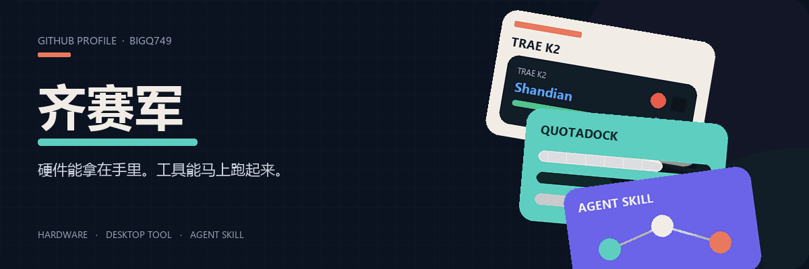

  <strong>简体中文</strong> · <a href="./README.en.md">English</a>

  

  <a href="https://bigq749.github.io/BigQ749/"><strong>打开互动主页 →</strong></a>
  &nbsp;·&nbsp;
  <a href="mailto:saijunqi@gmail.com">saijunqi@gmail.com</a>
  &nbsp;·&nbsp;
  <a href="https://github.com/BigQ749">GitHub</a>

GitHub README 不能运行真正的按钮和悬停。完整动效在 **[互动主页](https://bigq749.github.io/BigQ749/)**：光斑跟鼠标走，卡片会倾斜、浮动。

邮箱（直接写信）：[saijunqi@gmail.com](mailto:saijunqi@gmail.com)

---

| 项目 | 做什么 |
| --- | --- |
| [TRAE K2](https://github.com/BigQ749/trae-k2-remote) | 大赛工牌烧成闪电说 / PPT 遥控器 |
| [QuotaDock](https://github.com/BigQ749/quotadock) | 桌面额度浮窗，Codex / Grok / OpenCode 可分可合 |
| [Douyin Video Analyzer](https://github.com/BigQ749/douyin-video-analyzer-skill) | 抖音链接进，文字稿和摘要出 |
| [穹顶](https://github.com/BigQ749/dome-enterprise-ai-workbench) | 本地优先的企业 Agent 工作台 |
| [Typhoon Relief](https://github.com/BigQ749/typhoon-relief) | 附近 SOS + 防灾科普 |
| [Codex Growth Skills](https://github.com/BigQ749/codex-growth-skills) | 学习记忆和成长教练 |
