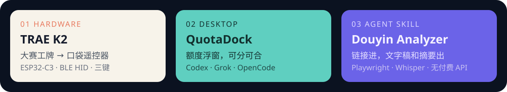

  <strong>简体中文</strong> · <a href="./README.en.md">English</a>

  

### Hi there 👋

我是 **齐赛军**。GitHub：[BigQ749](https://github.com/BigQ749)

我把能摸到的硬件、能挂在桌面上的工具、能交给 Agent 的 Skill，做到能用、能开源。

I build hardware you can hold, desktop tools you can run, and skills an agent can pick up.

📫 How to reach me:

- GitHub：[BigQ749](https://github.com/BigQ749)

  

  

My Products:

- [TRAE K2](https://github.com/BigQ749/trae-k2-remote) — 把 FoloToy 大赛工牌烧成闪电说 / PPT 蓝牙遥控器。不需要电脑伴侣脚本。
- [QuotaDock](https://github.com/BigQ749/quotadock) — Windows / macOS 额度浮窗。Codex、Grok、OpenCode 可分开，也能拖到一起。
- [Douyin Video Analyzer](https://github.com/BigQ749/douyin-video-analyzer-skill) — 抖音链接进，文字稿和摘要出。Playwright 取流，不靠付费解析 API。
- [穹顶](https://github.com/BigQ749/dome-enterprise-ai-workbench) — 本地优先的企业 Agent 工作台：资料、权限、任务、审核放在同一处。
- [Typhoon Relief](https://github.com/BigQ749/typhoon-relief) — 微信小程序。附近 SOS 互助，加上台风前后的防灾科普。
- [Codex Growth Skills](https://github.com/BigQ749/codex-growth-skills) — 给 Codex 用的学习记忆与成长教练 Skill。
